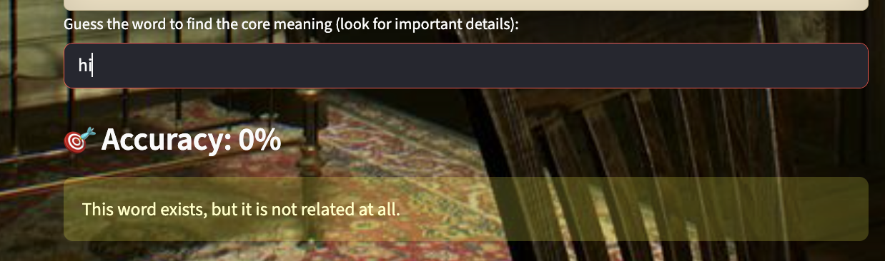
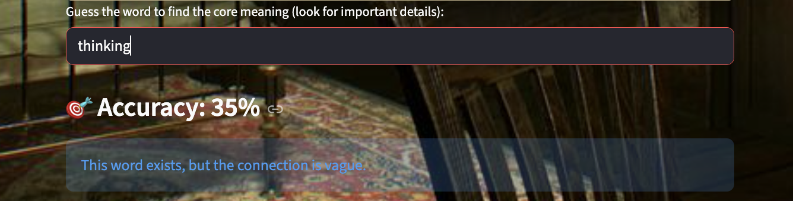
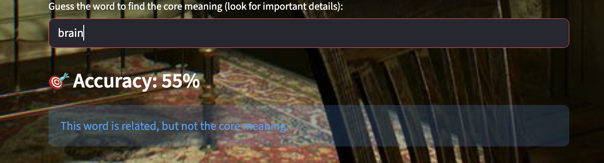

# 🌀 Labyrinth  
### A Semantic Escape Room Powered by the Endee Vector Database

> *You don’t escape by guessing.*  
> *You escape by understanding.*

---

## 🌒 Introduction

Labyrinth is not a traditional escape room, and it is not a keyword-based semantic demo.

It is an experience built around **meaning**.

Most semantic systems answer questions.  
**Labyrinth asks one.**

Instead of checking whether a word is correct, the system evaluates **how deeply the player understands what is happening**.

There are no passwords.  
There are no exact answers.

Only semantic understanding.

This project was created to deeply explore and understand how a vector database (**Endee**) works at a conceptual level — how text becomes vectors, how similarity is measured, and how semantic strength can be translated into **human-understandable feedback**.

Instead of building a search bar, we built a game where the only way forward is understanding.

---

## 🗝️ Concept: A Semantic Escape Room

The game is structured into **three rooms**, each representing a different mental state:

### Room I – Reminiscence  
Fractured memory and missing details

### Room II – Note to Yourself  
Subjective perspectives and conflicting interpretations

### Room III – Senses  
Emotional influence on understanding

Each room contains:

- A short narrative  
- A document written by the player’s past self  
- A hidden **core meaning**

The player types words they believe explain what is happening.

Progress is **not based on exact matches**, but on **semantic closeness**.

---

## ❓ Problem Statement

Most applications of vector databases focus on:

- Semantic search  
- Top-K similarity retrieval  
- Binary “similar / not similar” results  

While useful, these approaches do not communicate **how close** a query is to the intended meaning.

### The Problem

How can we design a system that evaluates **degrees of understanding**, not just correctness?

### The Solution

Use a vector database (**Endee**) as a **semantic signal engine**, and translate similarity strength into **interpretive feedback** that humans can understand.

---

## 🧠 Semantic Understanding Model

Instead of exposing raw similarity scores, Labyrinth maps semantic strength into four levels of understanding:

| Accuracy | Interpretation |
|--------|----------------|
| **0%** | The word exists in vector space, but is not related |
| **35%** | The word exists, but the connection is vague |
| **55%** | The word is clearly related, but not the core meaning |
| **75%** | Core understanding achieved (room unlocked) |

⚠️ **Important:**  
Every word — even unrelated ones — is still processed through **Endee**.  
The system distinguishes **existence in semantic space** from **relevance to intent**.

---

## 🏗️ System Design & Technical Approach

### High-Level Flow
```bash
User Input
↓
SentenceTransformer Embedding
↓
Vector Projection (32 dimensions)
↓
Endee Vector Database
↓
Semantic Similarity Signal
↓
Interpretation Logic
↓
Gameplay Feedback
```

---

### Core Components

#### 1. Embedding Layer
- SentenceTransformer converts text into dense vector embeddings
- Vectors are projected to **32 dimensions** to match the Endee index

#### 2. Vector Storage (Endee)
- All room documents are embedded and stored in Endee
- Each document chunk becomes a semantic reference point
- Endee acts as the **semantic memory** of the game

#### 3. Semantic Interpretation Layer
- Endee provides the similarity signal
- The application interprets that signal into human feedback
- Only intent-level understanding unlocks progression

---

## 🧩 How Endee Is Used (Core Requirement)

Endee is **central** to the project.

Endee is used to:

- Store all document embeddings
- Perform semantic search for **every user query**
- Provide similarity signals for interpretation
- Validate semantic relatedness beyond keywords

### API Usage Includes
- Index creation (cosine similarity)
- Vector insertion
- Real-time search queries
- Semantic signal extraction

Even when the result is **0%**, Endee is still queried — reinforcing the idea that semantic systems understand **existence**, not just correctness.

---

## 📐 Semantic Signal Interpretation (Conceptual Formula)

While Endee returns similarity signals internally, Labyrinth interprets them conceptually as:

semantic_strength = similarity(query_vector, document_vectors)

if semantic_strength < threshold_1 → 0%

elif semantic_strength < threshold_2 → 35%

elif semantic_strength < threshold_3 → 55%

else → 75%

This abstraction allows semantic systems to behave **interpretively**, not mechanically.

---

## 📸 Visual Walkthrough & Semantic Interpretation

This section showcases how semantic understanding progresses through **Labyrinth**.
Each screenshot corresponds to a different **semantic interpretation level**, powered by the Endee vector database and translated into human-readable feedback.

---

### 🏠 Landing Screen – Entry Point


**Description:**  
The player enters a quiet, atmospheric space.  
There are no explicit rules — only the idea that understanding is the only way forward.

---

### ❌ 0% Accuracy – Exists but Not Related



**Example Input:** `hi`

**Explanation:**  
The word exists in Endee’s vector space, but it has **no semantic relevance** to the room’s meaning.  
This demonstrates that semantic systems understand *existence*, not correctness.

---

### ⚠️ 35% Accuracy – Vague Connection



**Example Input:** `thinking`

**Explanation:**  
The word has a loose semantic association but does not explain what is happening.  
This represents early intuition without clarity.

---

### 🔗 55% Accuracy – Related but Not Core Meaning



**Example Input:** `brain`

**Explanation:**  
The word is clearly related to the theme, but it does not capture the core idea needed to progress.

---

### 🧠 Room I – Core Understanding Achieved


**Example Input:** `memory`

**Explanation:**  
Semantic intent aligns with the room’s meaning.  
Endee confirms strong similarity and the next room unlocks.

---

### ✉️ Room II – Perspective & Interpretation


**Explanation:**  
This room explores how the same event can be remembered differently depending on emotional perspective.

---

### 🎭 Room III – Emotion as Meaning


**Explanation:**  
Nothing external changes — only emotion does.  
Once the correct emotion is identified, the labyrinth no longer resists the player.

---


## 🖥️ User Experience & Aesthetics

The interface is intentionally:

- Narrative-driven
- Non-technical for the player

Feedback is phrased as understanding, not scoring:

- “This word exists, but is not related at all.”
- “The connection is vague.”
- “You are close.”
- “You understand what’s happening.”

The visuals reinforce the mental state of each room, aligning **aesthetics with semantics**.

---

## 📂 Project Structure
```bash
LABYRINTH/
│
├── app.py                  # Streamlit UI and semantic gameplay logic
├── load_endee.py           # Embeds room documents and loads them into Endee
├── docker-compose.yml      # Endee vector database service
├── README.md               # Project documentation
│
├── data/
│   ├── room1/
│   │   └── documents.txt   # Narrative + memory fragments (Room I – Reminiscence)
│   ├── room2/
│   │   └── documents.txt   # Conflicting perspectives (Room II – Note to Yourself)
│   └── room3/
│       └── documents.txt   # Emotional interpretation (Room III – Senses)
│
├── homeL.png               # Landing screen UI
├── room1.png               # Room I gameplay screen
├── room2.png               # Room II gameplay screen
├── room3.png               # Room III gameplay screen
│
├── 0%.png                  # Example: no semantic relation
├── 35%.png                 # Example: vague semantic connection
├── 55%.png                 # Example: related but not core meaning


````


---

## 🐳 Docker & Endee Setup

Endee runs locally using Docker.

⚙️ Setup & Execution Instructions
Prerequisites

Python 3.10+

Docker & Docker Compose

pip
```bash

1️⃣ Start Endee (Vector Database)
docker compose up -d


Endee will be available at:
http://localhost:8080

2️⃣ Load Documents into Endee

python load_endee.py

This step:

Reads room documents

Generates embeddings

Inserts vectors into Endee

Confirms successful indexing

3️⃣ Run the Application
streamlit run app.py


Open in your browser:
http://localhost:8501
```

---


## 🚀 Version Control & GitHub Deployment


This project is version-controlled using Git and can be pushed to GitHub using the following steps.
``` bash
git init  #Initialize Git Repository (if not already initialized)
git add .  #Add Project Files
git commit -m "Initial commit: Labyrinth semantic escape room using Endee"  #Commit Changes
git remote add origin https://github.com/akirti05/Labyrinth.git  #add remote repository
#push to github
git branch -M main
git push -u origin main
```


---


## 🛠️ Technologies Used

| Component | Technology |
|---------|------------|
| Language | Python |
| UI | Streamlit |
| Embeddings | SentenceTransformers |
| Vector Database | Endee |
| API | REST |
| Containerization | Docker |
| Styling | Custom CSS |

---

## 🎯 What This Project Demonstrates

Deep conceptual understanding of vector databases

Correct and meaningful use of Endee APIs

Semantic reasoning beyond keyword matching

Real-time vector search integration

Thoughtful interpretation of AI outputs

Strong alignment between UX and AI behavior

---

## 🏁 Conclusion

Labyrinth demonstrates how a vector database like Endee can be used not just for retrieval, but for reasoning, interpretation, and experience design.

It transforms semantic similarity into something humans can feel.

Endee is the foundation that makes this possible.

---